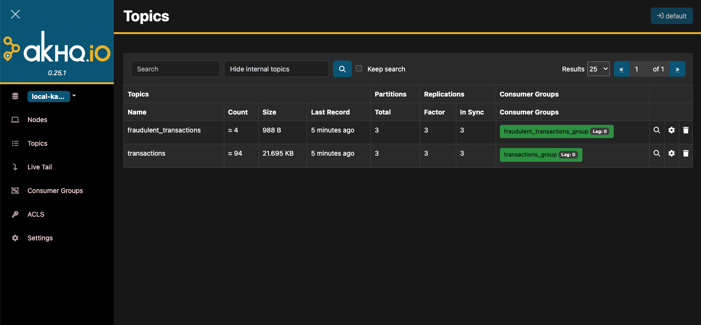

## Kafka infrastructure project

This is an infrastructure project to primarily showcase Apache Kafka. It's originated
from a proposed system design and a proposed practical coding problem for a real time
fraud detection system, for educational purposes. Be warned that the design or code were
not used in a real interview or project.

### Kafka design

This is the Kafka design of the practical part of the exercise, and what's inside this
repository:

-

### High level design

System design solution for the teorical part of the exercise:


### Data model

Data model solution for the theorical part:


### How to run this project and check the data

First, make sure you have `Docker` and `docker compose` installed on your machine. Then
run:

```bash
make u
```

This command will run all the containers necessary for the project. Take a look at the
logs of the applications. If you wish to see the topics in AKHQ (a graphical user
interface) access http://localhost:8080/. You'll see something like this:



If you wish to see the transactions identified as fradulent you can enter the PostgreSQL
container in another terminal:

```
make pg
```

List the database:

```bash
\l
```

Connect to the created `fraudulent_transactions` database:

```bash
\c fraudulent_transactions
```

Describe tables:

```bash
\dt
```

Query for some fraud transactions:

```bash
SELECT * FROM fraudulent_transactions WHERE fraud_type='high_frequency';
```

Hit `cmd/ctrl+d` if you wish to leave `psql`. Hit `cmd/ctrl+c` in your terminal if you wish to stop the containers. To run them in the background:

```bash
make ud
```
